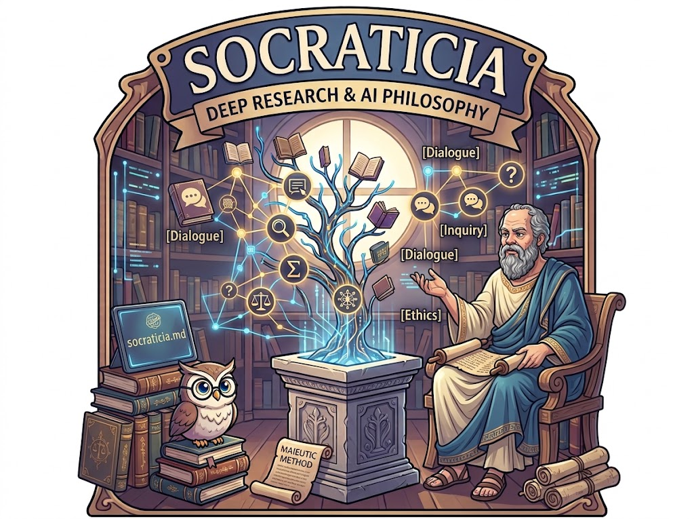

# SocraticIA


**SocraticIA is a Markdown-based framework for applying the Socratic method to LLM-driven knowledge discovery.**

The core idea is simple:

> **The question is the unit of exploration.
> The claim is the unit of verification.**

SocraticIA creates a structured environment where an LLM can continuously research a topic, derive new questions, gather evidence, verify claims, evaluate its own findings, and continue exploring the subject through multiple research epochs.

---

## Why?

LLMs are excellent at generating answers, but a fluent answer is not necessarily an accurate answer.

A model can produce:

* unsupported facts
* invented technical identifiers
* incorrect numbers
* plausible but incorrect APIs
* overconfident interpretations
* citations that are related to a topic but do not actually support the claim

SocraticIA attempts to reduce these problems by changing the research process rather than relying only on the model's raw knowledge.

---

## The Idea

Traditional LLM interaction:

```text
Question
   ↓
LLM
   ↓
Answer
```

SocraticIA:

```text
Topic
  ↓
Planning
  ↓
Questions
  ↓
Research
  ↓
Evidence
  ↓
Claim Verification
  ↓
Answer
  ↓
Evaluation
  ↓
New Questions
  ↓
Further Research
```

The process can repeat across multiple epochs.

---

## The Two Fundamental Units

### Question — Unit of Exploration

A topic is divided into questions.

Questions keep the research process focused while allowing the investigation to expand.

Example:

```text
How does CRISPR-Cas9 work?

    ↓

How does the guide RNA identify its target?

    ↓

What is the role of the PAM?

    ↓

How does Cas9 cleave DNA?

    ↓

How does the cell repair the break?
```

### Claim — Unit of Verification

Answers contain many individual claims.

Each important claim should be supported independently.

For technical topics, this includes verifying:

```text
name
existence
ID
version
fields
types
units
scaling
semantics
direction
implementation behavior
deprecation
```

An entity being real does not automatically make every statement about that entity true.

---

## Evidence First

SocraticIA follows this principle:

```text
Research
   ↓
Evidence
   ↓
Verification
   ↓
Writing
```

The agent is instructed to gather evidence before writing the answer.

Sources must support the actual claim being made.

A source that merely discusses the same topic does not automatically verify a claim.

---

## Technical Schema Verification

Technical claims receive additional scrutiny.

For example, verifying:

```text
GPS_RAW_INT exists
```

does not automatically verify:

```text
GPS_RAW_INT = message ID 24
lat = degE7
alt = millimetres
eph = specific unit
```

These are separate claims.

The same principle applies to:

* APIs
* functions
* classes
* protocol messages
* command IDs
* parameters
* configuration values
* executable code

For code, the exact method, module, signature, arguments, and behavior must be verified before the code is presented as runnable.

---

## Quantitative Claims

Numbers are treated as claims too.

The system should not infer:

```text
7-bit addressing
→ 128 usable devices
```

or:

```text
asyncio support
→ 500 Hz performance
```

or:

```text
USB-C
→ deterministic sub-millisecond latency
```

Exact values, performance measurements, limits, rankings, and comparative claims require direct evidence.

---

## Causal Claims

SocraticIA also distinguishes between facts and relationships.

For example:

```text
Fact A: an Arduino has a limited receive buffer.

Fact B: the protocol uses message framing.

Therefore:
message framing prevents buffer overflow.
```

The conclusion does not automatically follow.

The causal relationship itself requires evidence.

---

## Research Vault

A typical SocraticIA project creates:

```text
SocraticIA_Vault/
│
├── Config.md
├── MotherFile.md
├── Answers.md
├── Explanations.md
├── Eval.md
├── Conclusion.md
│
└── Questions/
    ├── Q001.md
    ├── Q002.md
    └── ...
```

### MotherFile.md

Contains:

* research goal
* planning
* question tree
* question status

### Questions/Qxxx.md

Contains the individual question and links to its answer, explanation, and evaluation.

### Answers.md

Contains the direct answers.

### Explanations.md

Contains detailed explanations and sources.

### Eval.md

Contains factual and quality evaluations.

### Conclusion.md

Contains the final research summary.

---

## Epochs

Research progresses through epochs.

Each epoch follows:

```text
Research
   ↓
Answer
   ↓
Evaluate
   ↓
Derive new questions
```

Questions are derived from the existing research instead of being generated arbitrarily.

This helps prevent topic drift.

---

## Question Derivation

New questions should:

* trace back to the original planning
* target important unanswered areas
* address weaknesses or uncertainties
* build on previous questions

This gradually forms a research graph:

```text
Q001
 ├── Q004
 ├── Q005
 └── Q006

Q002
 ├── Q007
 └── Q008
```

---

## Evaluation

SocraticIA separates:

### Answer Quality

How good is the answer?

Measured using:

* factual support
* counterarguments / limitations

### Importance

How important is the question to the overall research goal?

Importance does not directly increase the answer's grade. It controls which questions deserve further exploration.

---

## Why Self-Evaluation Is Not Enough

One of the main lessons from testing is that an LLM can incorrectly judge its own output.

A model can produce:

```text
Facts: 5/5
Grade: Good
```

while an external reviewer finds factual problems.

Therefore the evaluation system should be treated as part of the experiment, not as an independent guarantee of truth.

This distinction is important.

SocraticIA is intended to make research **more structured and auditable**, not to eliminate the need for human or external verification.

---

## Experiments

The framework has been tested across different domains, including:

* Arduino / Python
* drone programming and MAVLink
* CRISPR-Cas9
* superconducting quantum computing
* Roman history

The different domains are useful because they expose different types of failure.

For example, technical topics tend to expose:

```text
API hallucination
incorrect identifiers
wrong units
wrong numbers
version confusion
```

while historical and scientific topics expose:

```text
overgeneralization
interpretation presented as fact
weak source entailment
unsupported quantitative claims
```

---

## What the Experiments Show

The architecture has significantly reduced some obvious hallucination patterns, especially fabricated technical identifiers.

However, testing also exposed harder problems:

```text
Real entity
   ↓
Real source
   ↓
Incorrect interpretation
```

Examples include:

* incorrect units
* incorrect API syntax
* unsupported performance claims
* false causal relationships
* overly strong conclusions
* weak citation-to-claim matching

This suggests that reliable research is not simply a matter of adding more factual knowledge to the model.

The research process itself needs constraints.

---

## Current Status

SocraticIA should currently be considered an **experimental research framework**.

It does not guarantee factual correctness.

Its purpose is to explore whether structured questioning, evidence collection, claim-level verification, and iterative evaluation can improve the reliability and auditability of LLM-generated research.

---

## Core Philosophy

```text
Question
   ↓
Exploration

Claim
   ↓
Verification

Evidence
   ↓
Grounding

Epoch
   ↓
Iteration
```

Or in one sentence:

> **Questions drive discovery; evidence determines what is allowed to become knowledge.**

---

## Getting Started

1. Copy the SocraticIA system instructions into your LLM environment.
2. Configure the required file and web-search tools.
3. Provide a single research topic.
4. Let SocraticIA create the initial Planning and questions.
5. Confirm the initial research plan.
6. Run the research epochs.
7. Inspect the generated Markdown vault.
8. Independently verify important findings.

---

## Contributing

The most useful contributions are not necessarily more rules.

Useful contributions include:

* new benchmark questions
* adversarial test cases
* domain-specific evaluations
* examples of successful verification
* examples of failed verification
* better claim/evidence evaluation methods

The objective is to learn **which constraints actually improve research quality**.

---

## License

See the repository license.

---

## Philosophy

SocraticIA starts from a simple assumption:

> **Knowledge is not just the answers we have. It is also the questions that reveal what we still need to understand.**
